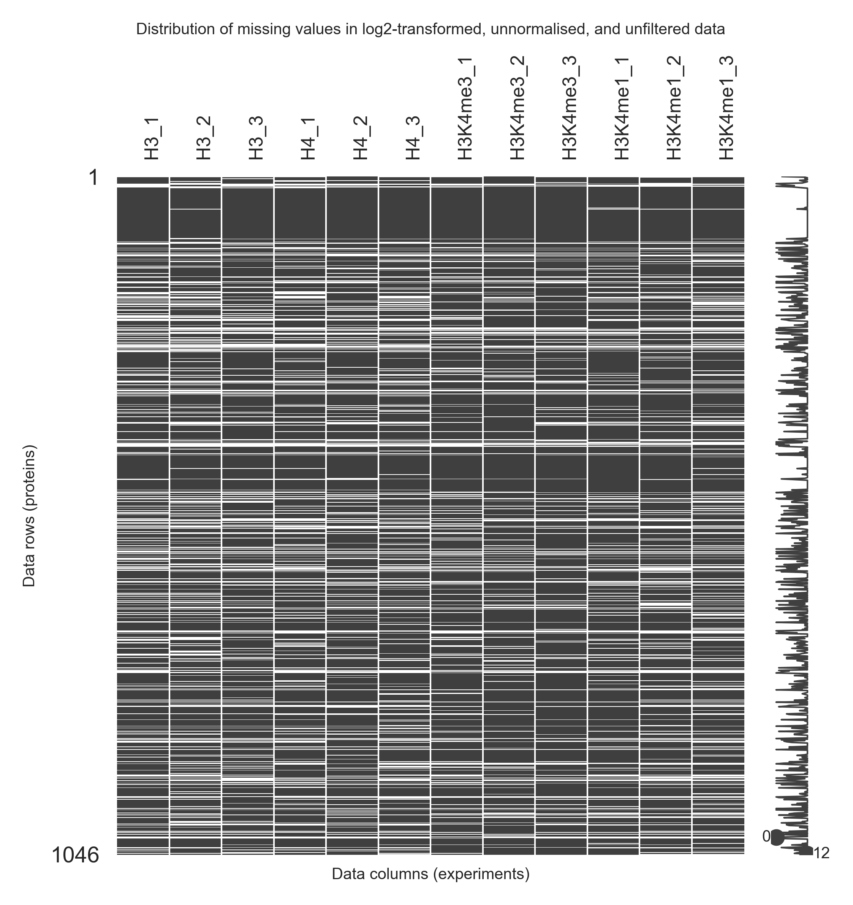
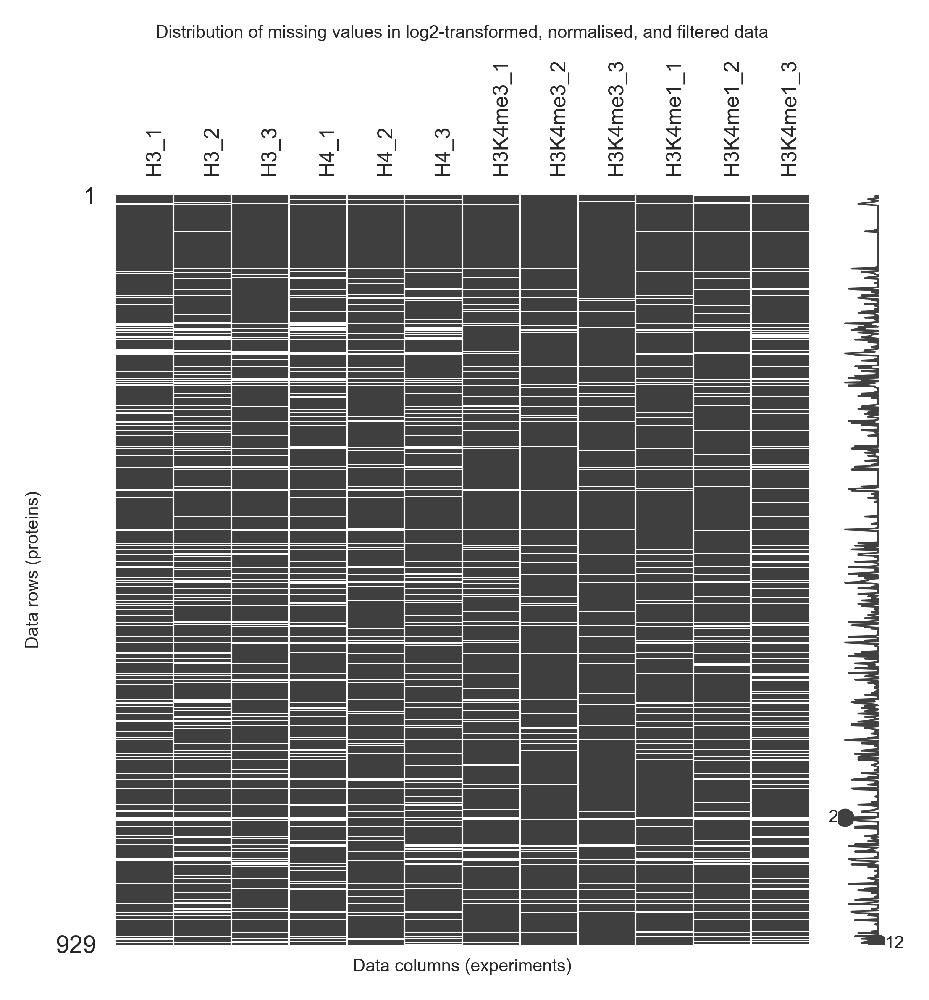
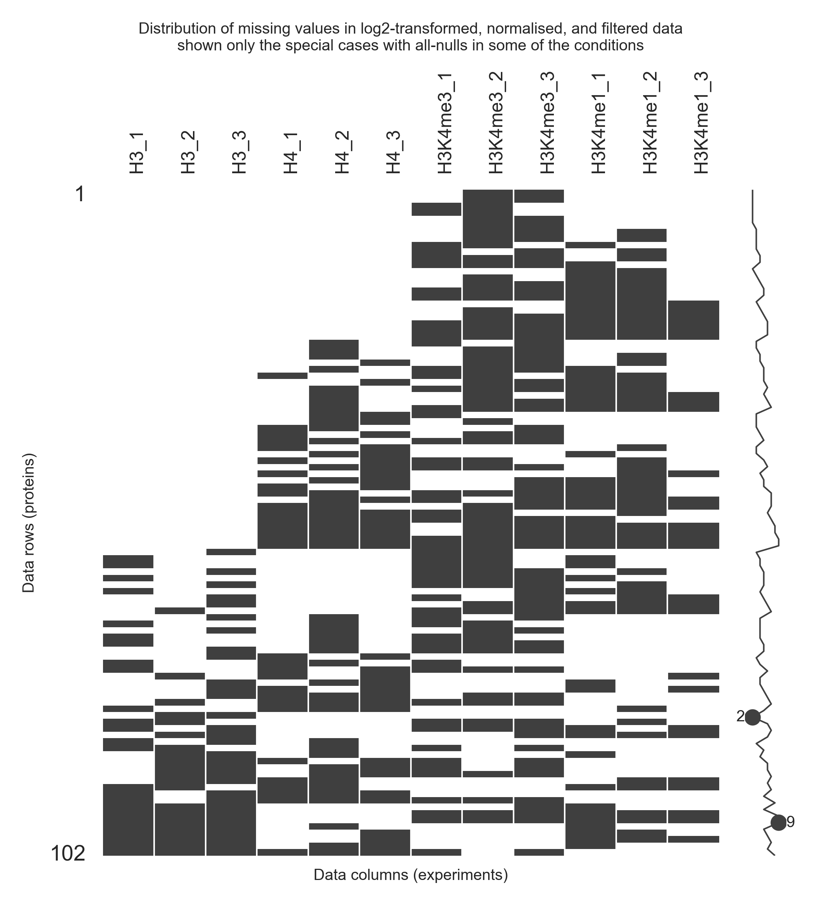

# H3K4me1/3 ChIP-MS Experiment Analysis Report

**Note that this notebook assumes that the pipeline was run to completion, without errors using the `run.sh`** If some linked files in the [`outputs`](outputs) folder are missing, consider re-running the pipeline and updating the notebook.

(It's best viewed in [MacDown](https://macdown.uranusjr.com/)).

Note that not all figures were included in the manuscript, and some of the figures and captions were adjusted in postprocessing.

## Stage 0: the dataset

The ChIP-MS experiment has been produced by Dr Andrey Tvardovskiy, contact him for the methods on the experimental part.

This analysis begins from the excel file containing the raw, unnormalised protein intensities as quantified by the mass spectrometry method.
The excel file is available at [`data/Chip_MS_H3K4me1_H3K4me3_2022_unnorm.xlsx`](data/Chip_MS_H3K4me1_H3K4me3_2022_unnorm.xlsx) and contains the protein metadata columns such as `Accession`, `Description`, `Coverage [%]`, `# Peptides`, `# Unique PTMs`.  Together with four groups of experiments: `H3`, `H4`, `H3K4me1`, and `H3K4me3`, three replicates each.

## Stage 1: Extraction of Data

The stage 1 of the data analysis is implemented in the notebook [`01-extracting.ipynb`](01-extracting.ipynb).
This stage of the analysis focuses on extraction of the data from excel files and attempts to shape it to a more digestible format.

First of all, the pipeline reads the excel file and parses the gene names from the `Description` column of each row. For instance, the pipeline parses the gene name `GBE1` can be parsed from the `Description` column for a protein with `Accesssion=Q04446` (below)

```
1,4-alpha-glucan-branching enzyme OS=Homo sapiens OX=9606 GN=GBE1 PE=1 SV=3
```

The pipeline then reindexes the input data based on such `Gene` names as the `Accession` columns are less readable.
The following two edge cases are handled:

1. `Accession` column is used as a fallback for genes with no gene name in the `Description` column (only `Immunoglobulin kappa light chain OS=Homo sapiens OX=9606 PE=1 SV=1`)
2. In case of two proteins sharing the same gene name, a suffix of `(1)` or `(2)` is added ot their gene names to be able to distinguish them (only applicable for `TMPO (1)`(`P42167`) and `TMPO (2)` (`P42166`)). The convention is to use a lower digit for proteins with higher coverage (%)

This corrected gene name column is called `Label` and is used to annotate proteins in every plot.

The pipeline then splits the numeric data from the metadata, and stores them in `outputs/01-extracting/data_numeric.csv`  and `outputs/01-extracting/data_metadata.csv` which are made available to the subsequent steps.

See also a transcript of the notebook's results in [`outputs/notebooks/01-extracting.ipynb`](outputs/notebooks/01-extracting.ipynb).

## Stage 2: Linking of ChIP-MS dataset to the MARCS identifiers

The stage 2 of the data analysis aims to link the ChIP-MS data to MARCS data, by matching the protein identifiers and gene names.
It is implemented in the notebook [`02-linking-to-MARCS.ipynb`](02-linking-to-MARCS.ipynb).

To match the datasets we utilise the `Accession` column in ChIP-MS output, as well as the `Gene` names that we parsed in the previous notebook.
The `Accession` columns are mapped to MARCS `Majority protein IDs` columns, and the `Gene` is mapped to the `Gene name` columns in MARCS. MARCS data is taken from the table S2 in the first submission. To link the ChIP-MS and MARCS identifiers we apply the Accession and Gene name mapping in an "either/or" kind of fashion. But as shown from the figure below, the two types of mappings are fairly similar:


[Figure link](outputs/02-linking-to-MARCS/01-venn-diagram-of-gene-label-mappability.pdf)
[Figure caption](outputs/02-linking-to-MARCS/01-venn-diagram-of-gene-label-mappability.pdf.caption.md)


However overall the mapping between ChIP-MS experiment and MARCS was not great 1352/1915 = 70.6% of labels are not mapped.

Additionally, some of the ChIP-MS genes mapped to multiple Gene labels in MARCS, for instance `ACIN1` maps to four gene labels in MARCS: `ACIN1 (1)`, `ACIN1 (2)`, `ACIN1 (3)`, and `ACIN1 (4)`.  And likewise some MARCS gene labels map to multiple ChIP-MS identifiers, for instance, MARCS data has three versions aforementioned proteins with gene name `TMPO`  i.e. `TMPO (1)`, `TMPO (2)`, and `TMPO (3)`. The precomputed mapping would map all of these three versions to the two versions of the `TMPO` gene in ChIP-MS data (a total of `3*2=6` mappings). The exact list of proteins with multimaps can be found in [the transcript of the notebook 02-linking-to-MARCS.ipynb](outputs/notebooks/02-linking-to-MARCS.ipynb). The gene name mapping itself is available in csv format at [outputs/02-linking-to-MARCS/02-marcs-to-chip-ms-mapping.csv](outputs/02-linking-to-MARCS/02-marcs-to-chip-ms-mapping.csv).

However, between the MARCS and ChIP-MS mappings we are only interested in the mappings to the MACS features. To be able to link these feature esimates to ChIP-MS gene, we utilise the table S3 from the first submission of MARCS manuscript, available from the machine readable intermediate outputs from the [MARCS<->ChIP-seq pipeline](https://ascgitlab.helmholtz-muenchen.de/ife/marcs/marcs-chip-seq-integration-bigwigs), specifically the data in the file [`docs/from-marcs-chipseq-analysis/table-s3.long.tsv.gz`](docs/from-marcs-chipseq-analysis/table-s3.long.tsv.gz) [^1]

[^1]: This file is identical to the outputs of table S3, but is just formatted in a way that is easier to digest, see the [code here](https://ascgitlab.helmholtz-muenchen.de/ife/marcs/marcs-chip-seq-integration-bigwigs/-/blob/master/scripts/data_sources/marcs/combine_marcs_table_s3.py).


The coverage of the MARCS feature associated proteins is also not great:


[Figure link](outputs/02-linking-to-MARCS/02-fraction-of-matched-proteins-in-marcs-categories.pdf)
[Figure caption](outputs/02-linking-to-MARCS/02-fraction-of-matched-proteins-in-marcs-categories.pdf.caption.md)

We see that we observe only 9/45 proteins strongly recruited to H3K4me3, with similar fractions from other features.


[Figure link](outputs/02-linking-to-MARCS/02-fraction-of-matched-proteins-in-marcs-categories-pearson-residuals.pdf)
[Figure caption](outputs/02-linking-to-MARCS/02-fraction-of-matched-proteins-in-marcs-categories-pearson-residuals.pdf.caption.md)

From the figure above we see that we observe _less_ proteins strongly recruited to H3ac, H4ac, H3K4me3, H2A.Z, H4K20me2, H3K27me3 than we would expect by chance[^2], yet we observe _more_ proteins recruited to meDNA, H3K9me3, than we would expect (note that lists in this sentence are not exhaustive and qualitative only - no hypothesis testing was done).

[^2]: We can estimate the number of proteins that we would hope to see by chance, by assuming the data follows a hypergeometric distribution with population size $N=1915$ (number of proteins in MARCS) and number of "successes" $K=563$ (i.e. number of proteins mapped to ChIP-MS data). For each category of size $n$ we would therefore expect $n \times K/N$ proteins to be matched between MARCS and ChIP-MS.

This, perhaps, highlights a major limitation of this analysis. The reason for such mapping may be technical, due to poor label matching, technical due to experiment design (i.e. non-specific binding of antibodies), or biological, due to differential abundance of the respective chromatin states.

We nevertheless proceed with the remaining analysis.

To facilitate them, we create a ChIP-MS indexed MARCS chromatin feature-association dataset, where we, match each ChIP-MS identified protein with the MARCS feature, taking the MARCS entry with lowest p-value in case of one-to-many mapping from the ChIP-MS. Using the aforementioned example of the `TMPO` gene, this would result in only two rows associated with `TMPO`: `TMPO (1)` and `TMPO (2)` (coming from ChIP-MS), each mapped to the (same) MARCS entry (out of the three `TMPO` variants available in MARCS), which has the lowest p-value for a given chromatin feature.

This mapping is available in the [`outputs/02-linking-to-MARCS/03-mapping-between-chip-ms-and-marcs-features.csv`](outputs/02-linking-to-MARCS/03-mapping-between-chip-ms-and-marcs-features.csv).

Additionally, the transcript of the notebook can be found [here](outputs/notebooks/02-linking-to-MARCS.ipynb).

## Stage 3: Data Transformations & Modelling

The notebook [`03-transformation-and-modelling.ipynb`](03-transformation-and-modelling.ipynb) defines the key aspect of the analysis: transformation and modelling of the MS datasets.

### Preprocessing

The notebook focuses on the numeric data produced in stage 1. As this data corresponds to the raw mass spectrometry intensities, the data is  log2-transformed. Since the _zero_ intensities were already masked in the original dataset (and therefore appear as "missing" entries), the log2 transformation does not need any special considerations (to avoid log2(0)) and such missing datasets readily pass-through into the log2-transformed representation:


[Figure link](outputs/03-transformation-and-modelling/01-EDA-log2-transformed-unnormalised-unfiltered-missing-values.png)
[Figure caption](outputs/03-transformation-and-modelling/01-EDA-log2-transformed-unnormalised-unfiltered-missing-values.png.caption.md)

In our modelling process, we will assume that the log2-transformed data is approximately normal. We quickly check this by plotting the data distribution and the corresponding normal distribution fit:


[Figure link](outputs/03-transformation-and-modelling/01-EDA-log2-transformed-unnormalised-unfiltered-normal-fit.pdf)
[Figure caption](outputs/03-transformation-and-modelling/01-EDA-log2-transformed-unnormalised-unfiltered-normal-fit.pdf.caption.md)

As it is clear from the figure above, the fit is not perfect, however, we do not have any good ways to account for that in the data analysis, and will therefore assume that it is "good enough" in the subsequent data analysis.

### Normalisation

To normalise, we focus on the histone proteins in the data.
The two most abundant ones are:

1. *H4C1*: Histone H4 OS=Homo sapiens OX=9606 GN=H4C1 PE=1 SV=2
2. *H2BC4*: Histone H2B type 1-C/E/F/G/I OS=Homo sapiens OX=9606 GN=H2BC4 PE=1 SV=4

In addition to the two histones above, there are eight additional core histones in the dataset.

1. *H2AC20*: Histone H2A type 2-C
2. *H2AC21*: Histone H2A type 2-B
3. *H2AW*: Histone H2A type 3
4. *H2AZ2*: Histone H2A.V
5. *H2BU1*: Histone H2B type 1-C/E/F/G/I
6. *H3-2*: Histone HIST2H3PS2
7.  *MACROH2A1*: Core histone macro-H2A.1
8. *MACROH2A2*: Core histone macro-H2A.2

Figure below highlights their unnormalised intensities.


[Figure  link](outputs/03-transformation-and-modelling/02-normalisation-histones-heatmap-unnormalised.pdf)
[Figure caption](outputs/03-transformation-and-modelling/02-normalisation-histones-heatmap-unnormalised.pdf.caption.md)

For each of the histone proteins in the dataset, we compute a mean log2 intensity across all 12 samples (average of 4 experiments, 3 replicates each for a given protein), and then subtract this mean from the log2 intensities, to obtain M-like offsets. We then take a median of such M offsets for all of the histone proteins as our normalisation factors.

This is illustrated in the following MA plot figure (unnormalised data), where the M-like offsets are on the Y axis and the mean log2 intensities on the X:


[Figure link](outputs/03-transformation-and-modelling/02-normalisation-log2-transformed-unnormalised-unfiltered-ma-plot.pdf)
[Figure caption](outputs/03-transformation-and-modelling/02-normalisation-log2-transformed-unnormalised-unfiltered-ma-plot.pdf.caption.md)

Alternatively, we can illustrate the normalisation factors in boxplots. Here the black lines indicate normalisation offsets centred at the mean of normalisation proteins.


[Figure (before normalisation) link](outputs/03-transformation-and-modelling/02-normalisation-boxplot.pdf)
[Figure (before  normalisation) caption](outputs/03-transformation-and-modelling/02-normalisation-boxplot.pdf.caption.md)

After normalisation, the MA plots shift so that the data is approximately centred around the x=0 zero line (red).


[Figure link](outputs/03-transformation-and-modelling/02-normalisation-log2-transformed-normalised-unfiltered-ma-plot.pdf)
[Figure caption](outputs/03-transformation-and-modelling/02-normalisation-log2-transformed-normalised-unfiltered-ma-plot.pdf.caption.md)


[Figure (after normalisation) link](outputs/03-transformation-and-modelling/02-normalisation-boxplot-post-normalisation.pdf)
[Figure (after  normalisation) caption](outputs/03-transformation-and-modelling/02-normalisation-boxplot-post-normalisation.pdf.caption.md)

After normalisation the aforementioned histone instensities appear as:


[Figure  link](outputs/03-transformation-and-modelling/02-normalisation-histones-heatmap-post-normalisation.pdf)
[Figure caption](outputs/03-transformation-and-modelling/02-normalisation-histones-heatmap-post-normalisation.pdf.caption.md)

The normalisation achieves better clustering of the Experimental replicates as evidenced by the PCA plots below:


[Figure (before normalisation) link](outputs/03-transformation-and-modelling/01-EDA-log2-transformed-unnormalised-unfiltered-PCA.pdf)
[Figure (before  normalisation) caption](outputs/03-transformation-and-modelling/01-EDA-log2-transformed-unnormalised-unfiltered-PCA.pdf.caption.md)


[Figure (after normalisation) link](outputs/03-transformation-and-modelling/02-normalisation-PCA-post-normalisation.pdf)
[Figure (after  normalisation) caption](outputs/03-transformation-and-modelling/02-normalisation-PCA-post-normalisation.pdf.caption.md)


Additionally, we include a pearson correlation matrix between all experiments:


[Figure link](outputs/03-transformation-and-modelling/02-correlation-matrix-of-normalised-data.pdf)
[Figurecaption](outputs/03-transformation-and-modelling/02-correlation-matrix-of-normalised-data.pdf.caption.md)

Note the lower correlation between H3K4me1 replicates (compared to other experiments)

### Filtering

Due to the large number of missing values, in the model it is counterproductive to include all datapoints in the model.
We therefore only keep the proteins that were identified in at least two replicates in at least one condition. As seen in the [transcript of the third notebook](outputs/notebooks/03-transformation-and-modelling.ipynb) 929/1046 proteins identified in ChIP-MS match this criterion. 117 proteins are thus filtered out. In the final outputs the filtered out proteins will have the comment "Insufficient number of non-null values".

Note that this does _not_ remove _all_ proteins with missing values, as shown in the figure below:


[Figure link](outputs/03-transformation-and-modelling/03-modelling-log2-transformed-normalised-filtered-missing-values.pdf)
[Figure caption](outputs/03-transformation-and-modelling03-modelling-log2-transformed-normalised-filtered-missing-values.png.caption.md)

Most importantly there are a few special cases of remaining proteins that have _all_ values missing in some, but not all conditions, as shown below:


[Figure link](outputs/03-transformation-and-modelling/03-modelling-log2-transformed-normalised-filtered-missing-values-all_zero_in_some_condition.png)
[Figure caption](outputs/03-transformation-and-modelling/03-modelling-log2-transformed-normalised-filtered-missing-values-all_zero_in_some_condition.png.caption.md)

A few example proteins of such special cases are:

- `FAM98A`, `PHF8`, `EIF4G1`, `ZMYND11` - proteins which have controls as null, but ChIPs as non-null.
-  `PSMC1`, `SNTB2`, `TUBB2A`, `TNNT3` - proteins which have ChIPs as null, but controls as non-null

### Modelling

For modelling, we interpret the column names of the numeric data to be of the format `{Experiment}_{Replicate}`, that is `H3_2` would imply `Experiment=H3` and `Replicate=2`. The data is then modelled using a zero-interecept means model in [`limma`](https://bioconductor.org/packages/release/bioc/html/limma.html):

```
~ 0 + Experiment
```

Which creates a design matrix with four coefficients with the following interpretations:

1. Coefficient: `ExperimentH4`
    -  Interpretation: mean(`H4_1`, `H4_2`, `H4_3`)
2. Coefficient `ExperimentH3`
    - Interpretation: mean(`H3_1`, `H3_2`, `H3_3`)
3. Coefficient `ExperimentH3K4me1`
    - Interpretation: mean(`H3K4me1_1`, `H3K4me1_2`, `H3K4me1_3`)
4. Coefficient `ExperimentH3K4me3`
    - Interpretation: mean(`H3K4me3_1`, `H3K4me3_2`, `H3K4me3_3`)

To extract biologically meaningful estimates from these interpretations we define the following contrasts:

1. Contrast `H3K4me1vsControl`  ⃪ `ExperimentH3K4me1-(ExperimentH4 + ExperimentH3)/2`
   - Interpretation: mean(`H3K4me1_1`, `H3K4me1_2`, `H3K4me1_3`) - mean( mean(`H4_1`, `H4_2`, `H4_3`), mean(`H3_1`, `H3_2`, `H3_3`))
   - Note that data is in log2 scale, and therefore the subtraction above iss equivalent to division in natural scale, and the contrasts should be interpreted as `log2(FC: H3K4me1 vs Controls)`.
2. Contrast `H3K4me3vsControl`  ⃪ `ExperimentH3K4me3-(ExperimentH4 + ExperimentH3)/2`
    -  Interpretation: mean(`H3K4me3_1`, `H3K4me3_2`, `H3K4me3_3`) - mean( mean(`H4_1`, `H4_2`, `H4_3`), mean(`H3_1`, `H3_2`, `H3_3`))
3. Contrast `H3K4me3vsH3K4me1`  ⃪ `ExperimentH3K4me3-ExperimentH3K4me1`
    - Interpretation: mean(`H3K4me3_1`, `H3K4me3_2`, `H3K4me3_3`) - mean(`H3K4me1_1`, `H3K4me1_2`, `H3K4me1_3`)
    - Note this is equivalent to `H3K4me3vsControl` - `H3K4me1vsControl` as the mean of controls cancels out.

The printouts of design and contrast matrices are available in the [transcript of the third notebook](outputs/notebooks/03-transformation-and-modelling.ipynb).

The model was fit using `limma::lmFit` (default parameters), followed by `limma::contrasts.fit` (default parameters), followed by `limma::eBayes` (parameter `robust=TRUE`).

The missing values were passed into the model unimputed (as nulls), and the model is expected to handle such cases by dropping the missing datapoints, i.e. it would treat certain genes as having fewer than three replicates, depending on the missing value pattern. In some cases, when enough values are missing, the model coefficient would fail to be estimated, for instance:

1. `PHF8` has no estimate for `ExperimentH3` and `ExperimentH4` coefficients (as _all_ values in the two controls are missing), and therefore no estimates for `H3K4me1vsControl`, and `H3K4me3vsControl` contrasts, despite being detected in`H3K4me3` and `H3K4me1` experiments. Note, however, that `H3K4me3vsH3K4me1` effect is still estimated correctly.
2. `FAM98A` has no estimate for `ExperimentH3`, but estimates for the remaining three effects, and, similarly `EIF4G1` and `ZMYND11`are missing estimates for `ExperimentH4` only. In such cases all of these proteins still have no estimates for `H3K4me1vsControl`, and `H3K4me3vsControl` contrasts  (as _both_ `H3` and `H4` effects are required to estimate them), however all of these proteins have estimates for `H3K4me3vsH3K4me1`
3. `PSMC1` and `TUBB2A` have no estimate for `ExperimentH3K4me1` meaning it has no contrast estimates for `H3K4me1vsControl`, and `H3K4me3vsH3K4me1`, Similarly `SNTB2` has no estimate for `ExperimentH3K4me3`, and therefore no contrast estimates for `H3K4me3vsControl`, and `H3K4me3vsH3K4me1.`
4. Finally, `TNN3` has estimates only for the `Control`-associated samples meaning it has no contrast estiamates at all.

The estimatable contrasts were tested for significance using `limma::toptable` function, assuming null hypothesis that such contrasts are equal to zero and a Benjamini/Hochberg FDR of 0.05 (all contrasts tested independently). For the numbers of statistically non-zero contrasts see [transcript of the third notebook](outputs/notebooks/03-transformation-and-modelling.ipynb).

#### Sanity checks for coefficient interpretation

The modeling approach above uses rather sophisticated procedure to obtain what is essentially the difference in means for each of the samples.
As a sanity check, we can compute the model contrasts using the simple `mean` operations in the code and compare them to the model outputs.
The following three figures indicate the correspondence between the model contrast estimates, and the "naively" computed means. The correlations should be perfect:


[Figure H3K4me1vsControl link](outputs/03-transformation-and-modelling/04-modelling-sanity-checks-for-coefficient-interpretation-H3K4me1vsControl.pdf)
[Figure H3K4me1vsControl caption](outputs/03-transformation-and-modelling/04-modelling-sanity-checks-for-coefficient-interpretation-H3K4me1vsControl.pdf.caption.md)


[Figure H3K4me3vsControl link](outputs/03-transformation-and-modelling/04-modelling-sanity-checks-for-coefficient-interpretation-H3K4me3vsControl.pdf)
[Figure H3K4me3vsControl caption](outputs/03-transformation-and-modelling/04-modelling-sanity-checks-for-coefficient-interpretation-H3K4me3vsControl.pdf.caption.md)


[Figure H3K4me3vsControl link](outputs/03-transformation-and-modelling/04-modelling-sanity-checks-for-coefficient-interpretation-H3K4me3vsH3K4me1.pdf)
[Figure H3K4me3vsH3K4me1caption](outputs/03-transformation-and-modelling/04-modelling-sanity-checks-for-coefficient-interpretation-H3K4me3vsH3K4me1.pdf.caption.md)

Note that, the computation mean(mean(H3), mean(H4)) as done by the model is in similar, but in general not equal to the computation mean(H3, H4), as illustrated by the figures below:


[Figure H3K4me1vsControl link](outputs/03-transformation-and-modelling/04-modelling-sanity-checks-for-coefficient-interpretation-H3K4me1vsControl-simple-mean-of-controls.pdf)
[Figure H3K4me1vsControl caption](outputs/03-transformation-and-modelling/04-modelling-sanity-checks-for-coefficient-interpretation-H3K4me1vsControl-simple-mean-of-controls.pdf.caption.md)


[Figure H3K4me3vsControl link](outputs/03-transformation-and-modelling/04-modelling-sanity-checks-for-coefficient-interpretation-H3K4me3vsControl-simple-mean-of-controls.pdf)
[Figure H3K4me3vsControl caption](outputs/03-transformation-and-modelling/04-modelling-sanity-checks-for-coefficient-interpretation-H3K4me3vsControl-simple-mean-of-controls.pdf.caption.md)

We will use the latter observation to impute the cases where logFC could not be estimated due to the data for one of the controls being missing.

#### Sanity checks for data behaviour

The previous sanity checks were purely about whether the model does what we expect it to do.
We now will try to visualise whether the data results match what we would expect intuitively, and/or whether they look "artifacty".
To do this we will plot the normalised data for significantly differential proteins in the three conditions, sorted by their coefficient estimates.

First, we plot the heatmap of H3K4me3vsControl estimates (`logFC`):


[Figure H3K4me3vsControl link](outputs/03-transformation-and-modelling/05-modelling-heatmap-of-significant-proteins-for-H3K4me3vsControl.pdf)
[Figure H3K4me3vsControl caption](outputs/03-transformation-and-modelling/05-modelling-heatmap-of-significant-proteins-for-H3K4me3vsControl.pdf.caption.md)

Note that for all samples absolute H3K4me3 intensities are greater than their control (H3 and H4) counterparts, like we would expect from proteins significant in this contrast.Note also, that H4 controls tend to have lower values for most of these proteins, when compared to their H3 counterparts.  Note, also, that certain experiments exhibit systemic biases (i.e. are either sytemically higher or systemically lower across the whole spectrum, we tried to correct for this in the normalisation step, but it is clearly not perfect.

Next, the heatmap of H3K4me1vsControl estimates (logFC) yields similar conclusions. Note that in this case the H3K4me1 response levels are very similar to H3K4me3, which was not the case for majority of H3K4me3-recruited proteins.


[Figure H3K4me1vsControl link](outputs/03-transformation-and-modelling/05-modelling-heatmap-of-significant-proteins-for-H3K4me1vsControl.pdf)
[Figure H3K4me1vsControl caption](outputs/03-transformation-and-modelling/05-modelling-heatmap-of-significant-proteins-for-H3K4me1vsControl.pdf.caption.md)

Finally, the H3K4me1 vs H3K4me3 dataset shows the proteins differentially enriched between H3K4me3 and H3K4me1 samples. Note that the raw data for this plot is normalised differently to that of the previous plots: in this plot the mean effect of H3K4me3 and H3K4me1 is normalised to be zero. Note that the H3K4me3vsH3K4me1 fold change corresponds to what we would expect. Note also that some proteins, e.g. HSPA5 have much larger effects associated with controls than with any of the H3K4me1/3 ChIPs (indicating that such proteins are excluded by the chromatin modifications).


[Figure H3K4me3vsH3K4me1 link](outputs/03-transformation-and-modelling/05-modelling-heatmap-of-significant-proteins-for-H3K4me3vsH3K4me1.pdf)
[Figure H3K4me3vsH3K4me1 caption](outputs/03-transformation-and-modelling/05-modelling-heatmap-of-significant-proteins-for-H3K4me3vsH3K4me1.pdf.caption.md)

### Imputation of modelling results

As the missing data in the model produced a singificant number of artefacts, it is important to attempt to correct for some of them. In particularly, we have previously illustrated a few special cases of proteins in which the missing data in either the control or important ChIPs caused no estimate at all.
It would be important to still handle such cases somehow.

Furthermore, a more subtle issue introduced by the missing data occurs when a protein's coefficient estimate is based only on a single datapoint. While in such cases the model is able to produce a parameter estimate, and, in some cases, an estimate of statistical significance, it could be argued that such estimates are not as trustworthy as estimates based on more datapoints.

Therefore, in the final stage of the modelling we do the following:

1. flag the following result estimates:
    - estimates which are based only on one data point (i.e. only one value in one of the conditions that the contrast is estimated from)
    - imputed estimates (see below)
2. impute certain fold change estimates, namely:
    - mark proteins detected in treatments, but not detected in both controls as "infinitely enriched" (logFC=+inf)
    - mark proteins detected in both controls, but not in treatmets as "infinitely excluded" (logFC=-inf)
    - in cases where logFC could not be estimated because one (but not both!) controls are missing, calculate the logFC only from the control that is detected using the "simple mean" strategy instead of the mean of means.
    - note that the term "control" in the above bullet points can mean either the H3&H4 (in case of H3K4me1vsControl and H3K4me3vsControl) contrasts, or "H3K4me1" in case of H3K4me3vsH3K4me1 contrast.

For instance, using the representative examples from before, the imputation should do the following:

1. Impute `PHF8` to have infinite enrichments for `H3K4me1vsControl` and `H3K4me3vsControl`. As it has no estimate for `ExperimentH3` and `ExperimentH4` coefficients (as _all_ values in the two controls are missing), but is detected in `H3K4me3` and `H3K4me1` experiments.
2. Impute the estimates for `FAM98A`, `EIF4G1` and `ZMYND11` using fold change against simple mean of controls as they have estimates for one control (H3 or H4) but not both.
3. Impute `H3K4me1vsControl` to negative infinity for `PSMC1` and `TUBB2A` , and `H3K4me3vsH3K4me1` as positive infinity as they have no estimate for `ExperimentH3K4me1`. Similarly impute `SNTB2` to have `H3K4me3vsControl` and `H3K4me3vsH3K4me1`  estimates of negative infinity as this protein has no estimate for `ExperimentH3K4me3`.
4. Finally, since `TNN3` has estimates only for the `Control`-associated samples, it should have `H3K4me1vsControl` and `H3K4me3vsControl` imputed to infinity, but no estimate for `H3K4me3vsH3K4me1`.

Such flags are reflected in the `Comment` field of the final model output, with strings as:

- `logFC(xxxxx) estimation was based on a single datapoint only` - model estimation succeeded, but based only on one datapoint
- `logFC(xxxxx) estimation failed and was imputed` - model estimation failed, but we were able to impute the estimate
- `logFC(xxxxx) estimation failed and was imputed based on a single datapoint only ` - model estimation failed, but we were able to impute the estimate, unfortunately, the imputation is based on a single datapoint only.
- `logFC(xxxx) estimation failed` - model estimation failed and could not be imputed

See [transcript of the third notebook](outputs/notebooks/03-transformation-and-modelling.ipynb) for the tally of the number of times each imputation case was produced.

The following heatmaps highlights the behaviour of the imputation procedure, showing the imputed values and the sparse normalised data they are based from:


[Figure H3K4me3vsControl link](outputs/03-transformation-and-modelling/06-modelling-imputed-values-for-H3K4me3vsControl.pdf)
[Figure H3K4me3vsControl caption](outputs/03-transformation-and-modelling/06-modelling-imputed-values-for-H3K4me3vsControl.pdf.caption.md)


[Figure H3K4me1vsControl link](outputs/03-transformation-and-modelling/06-modelling-imputed-values-for-H3K4me1vsControl.pdf)
[Figure H3K4me1vsControl caption](outputs/03-transformation-and-modelling/06-modelling-imputed-values-for-H3K4me1vsControl.pdf.caption.md)


[Figure H3K4me3vsH3K4me1 link](outputs/03-transformation-and-modelling/06-modelling-imputed-values-for-H3K4me3vsH3K4me1.pdf)
[Figure H3K4me3vsH3K4me1 caption](outputs/03-transformation-and-modelling/06-modelling-imputed-values-for-H3K4me3vsH3K4me1.pdf.caption.md)


### Visualisations

As a final sanity check we visualise the key results of the model.

#### Venn diagrams

First, a visualisation of the co-relationships between significantly non-zero contrasts as detected by the model.


[Figure link](outputs/03-transformation-and-modelling/08-venn-diagram-significant.pdf)
[Figure caption](outputs/03-transformation-and-modelling/08-venn-diagram-significant.pdf.caption.md)

Secondly, the overlap between singnificantly non-zero contrasts that are based on >1 data point.


[Figure link](outputs/03-transformation-and-modelling/08-venn-diagram-significant-more-than-one-datapoint.pdf)
[Figure caption](outputs/03-transformation-and-modelling/08-venn-diagram-significant-more-than-one-datapoint.pdf.caption.md)

Third, the overlap between significantly non-zero contrasts for subset of proteins which have positive (greater than zero) fold changes for me1/me3


[Figure link](outputs/03-transformation-and-modelling/08-venn-diagram-significant-me1me3-positive.pdf)
[Figure caption](outputs/03-transformation-and-modelling/08-venn-diagram-significant-me1me3-positive.pdf.caption.md)

#### Scatterplots

A scatterplot of all model results, full scale.


[Figure link](outputs/03-transformation-and-modelling/09-scatterplot-full-results_logfc.pdf)
[Figure caption](outputs/03-transformation-and-modelling/09-scatterplot-full-results_logfc.pdf.caption.md)


A scatterplot of all model results, zoomed in to an interesting region of the logFC space:


[Figure link](outputs/03-transformation-and-modelling/09-scatterplot-full-results_logfc_zoomed_in.pdf)
[Figure caption](outputs/03-transformation-and-modelling/09-scatterplot-full-results_logfc_zoomed_in.pdf)

Note that the main scatter of proteisn does not fall directly on the x=y line, but is rather tilted towards H3K4me3, which could indicate some sort of preference for these proteins towards H3K4me3-antibody recognisable regions of chromatin, or, could equivalently indicate a normalisation defect (i.e. median normalisation across all proteins, not just histones, will likely cancel this effect out).

### Other outputs

This concludes the main outputs of this stage of the model. We additionally produce the following csv with all of the model's outputs

- [outputs/03-transformation-and-modelling/07-output-full_results.csv](outputs/03-transformation-and-modelling/07-output-full_results.csv)

The transcript of this notebook can be found at [`outputs/notebooks/03-transformation-and-modelling.ipynb`](outputs/notebooks/03-transformation-and-modelling.ipynb).

## Stage 4: Integration with MARCS

At the fourth stage of the pipeline we set out to integrate the model results with MARCS data. To do this, we make use the results from stages 2 and 3, namely the MARCS feature-effects estimates (reindexed by ChIP-MS labels), and the model outputs.

We begin by testing whether genes strongly recruited/excluded by MARCS features have higher/lower estimates for the three model contrasts (H3K4me1vsControl, H3K4me3vsControl, and H3K4me3vsH3K4me1) compared to genes that are neither strongly recruited/excluded by MARCS features, or genes for which no feature effect estimate was possible. For this we use the imputed fold change estimates defined in the previous stage, and only take the proteins mappable to MARCS into account. The test used is [Mann-Whitney U](https://pingouin-stats.org/generated/pingouin.mwu.html), and is performed only for features for which we have at least 5 strongly recruited/excluded proteins with model and control estimates. The significance is assumed at 0.05 Benjamini/Hochberg FDR. The p-values for all coefficients are adjusted jointly.

For visualisations we additionally compute the difference between the mean log2FC estimates associated with MARCS feature and the mean log2FCs of the "control group" of proteins (Neither strongly recruited, nor excluded/No estimate). To be able to handle the "infinite" logFCs, we have temproarily replaced them with the maximum finite logFCs for the coefficient plus a small number (0.01), (or, equivalently, negative infinities with minimum logFC minus a small number).

The results of these test procedures are available in [outputs/04-integrating-results-with-MARCS/01-mwu-test-results-coef-against-feature.csv](outputs/04-integrating-results-with-MARCS/01-mwu-test-results-coef-against-feature.csv).

Visually, these results are represented in the following heatmap:


[Figure link](outputs/04-integrating-results-with-MARCS/02-mwu-heatmap-of-marcs-feature-enrichments.pdf)
[Figure caption](outputs/04-integrating-results-with-MARCS/02-mwu-heatmap-of-marcs-feature-enrichments.pdf.caption.md)

Note that there are very few significant relationships.

Nevertheless, it is perhaps interesting to observe the relationships between datasets qualititatively.

To achieve this we generate the following heatmap showing the relationship between H3K4me3vsH3K4me1 contrast, and MARCS feature effect estimates. Note the caption of these figures which indicates the meaning of different scatter markers.

First a heatmap of complete list of proteins with significant H3K4me3vsH3K4me1 contrasts, including the proteins with infinite enrichments based on more data point, and the corresponding MARCS feature estimates:


[Figure H3K4me3vsH3K4me1 vs MARCS link](outputs/04-integrating-results-with-MARCS/03-differential-proteins-vs-marcs.pdf)
[Figure H3K4me3vsH3K4me1 vs MARCS caption](outputs/04-integrating-results-with-MARCS/03-differential-proteins-vs-marcs.pdf.caption.md)

Note that this plot is quite sparse due to poor mapping between MARCS features and ChIP-MS.

Perhaps it is therefore more appropriate to instead plot the coefficient estimates for proteins associated with MARCS features only:

MARCS H3K4me3


[Figure MARCS H3K4me3  link](outputs/04-integrating-results-with-MARCS/04-marcs-H3K4me3-vs-chip-ms.pdf)
[Figure MARCS H3K4me3 caption](outputs/04-integrating-results-with-MARCS/04-marcs-H3K4me3-vs-chip-ms.pdf.caption.md)

MARCS H3ac


[Figure MARCS H3ac  link](outputs/04-integrating-results-with-MARCS/04-marcs-H3ac-vs-chip-ms.pdf)
[Figure MARCS H3ac caption](outputs/04-integrating-results-with-MARCS/04-marcs-H3ac-vs-chip-ms.pdf.caption.md)

MARCS H3K9acK14ac


[Figure MARCS H3K9acK14ac  link](outputs/04-integrating-results-with-MARCS/04-marcs-H3K9acK14ac-vs-chip-ms.pdf)
[Figure MARCS H3K9acK14ac caption](outputs/04-integrating-results-with-MARCS/04-marcs-H3K9acK14ac-vs-chip-ms.pdf.caption.md)

MARCS H3K9me3


[Figure MARCS H3K9me3  link](outputs/04-integrating-results-with-MARCS/04-marcs-H3K9me3-vs-chip-ms.pdf)
[Figure MARCS H3K9me3 caption](outputs/04-integrating-results-with-MARCS/04-marcs-H3K9me3-vs-chip-ms.pdf.caption.md)

MARCS H4ac


[Figure MARCS H4ac  link](outputs/04-integrating-results-with-MARCS/04-marcs-H4ac-vs-chip-ms.pdf)
[Figure MARCS H4ac caption](outputs/04-integrating-results-with-MARCS/04-marcs-H4ac-vs-chip-ms.pdf.caption.md)

MARCS meDNA


[Figure MARCS meDNA  link](outputs/04-integrating-results-with-MARCS/04-marcs-meDNA-vs-chip-ms.pdf)
[Figure MARCS meDNA caption](outputs/04-integrating-results-with-MARCS/04-marcs-meDNA-vs-chip-ms.pdf.caption.md)

### Summary scatterplots

As a final figure of the analysis it is worth producing a summary scatterplot of all of the model results with an overlay to MARCS features.
Such scatterplots are produced below


[Figure MARCS H3K4me3  link](outputs/04-integrating-results-with-MARCS/05-scatterplot-marcs-H3K4me3-vs-chip-ms.pdf)
[Figure MARCS H3K4me3 caption](outputs/04-integrating-results-with-MARCS/05-scatterplot-marcs-H3K4me3-vs-chip-ms.pdf.caption.md)
[Figure MARCS H3K4me3 plot data](outputs/04-integrating-results-with-MARCS/05-scatterplot-marcs-H3K4me3-vs-chip-ms.pdf.plot_data.csv)


[Figure MARCS H3K9acK14ac  link](outputs/04-integrating-results-with-MARCS/05-scatterplot-marcs-H3K9acK14ac-vs-chip-ms.pdf)
[Figure MARCS H3K9acK14ac caption](outputs/04-integrating-results-with-MARCS/05-scatterplot-marcs-H3K9acK14ac-vs-chip-ms.pdf.caption.md)
[Figure MARCS H3K9acK14ac plot data](outputs/04-integrating-results-with-MARCS/05-scatterplot-marcs-H3K9acK14ac-vs-chip-ms.pdf.plot_data.csv)


[Figure MARCS H3K9me3  link](outputs/04-integrating-results-with-MARCS/05-scatterplot-marcs-H3K9me3-vs-chip-ms.pdf)
[Figure MARCS H3K9me3 caption](outputs/04-integrating-results-with-MARCS/05-scatterplot-marcs-H3K9me3-vs-chip-ms.pdf.caption.md)
[Figure MARCS H3K9me3 plot data](outputs/04-integrating-results-with-MARCS/05-scatterplot-marcs-H3K9me3-vs-chip-ms.pdf.plot_data.csv)


[Figure MARCS H3ac  link](outputs/04-integrating-results-with-MARCS/05-scatterplot-marcs-H3ac-vs-chip-ms.pdf)
[Figure MARCS H3ac caption](outputs/04-integrating-results-with-MARCS/05-scatterplot-marcs-H3ac-vs-chip-ms.pdf.caption.md)
[Figure MARCS H3ac plot data](outputs/04-integrating-results-with-MARCS/05-scatterplot-marcs-H3ac-vs-chip-ms.pdf.plot_data.csv)


[Figure MARCS H4ac  link](outputs/04-integrating-results-with-MARCS/05-scatterplot-marcs-H4ac-vs-chip-ms.pdf)
[Figure MARCS H4ac caption](outputs/04-integrating-results-with-MARCS/05-scatterplot-marcs-H4ac-vs-chip-ms.pdf.caption.md)
[Figure MARCS H4ac plot data](outputs/04-integrating-results-with-MARCS/05-scatterplot-marcs-H4ac-vs-chip-ms.pdf.plot_data.csv)


[Figure MARCS meDNA  link](outputs/04-integrating-results-with-MARCS/05-scatterplot-marcs-meDNA-vs-chip-ms.pdf)
[Figure MARCS meDNA caption](outputs/04-integrating-results-with-MARCS/05-scatterplot-marcs-meDNA-vs-chip-ms.pdf.caption.md)
[Figure MARCS meDNA plot data](outputs/04-integrating-results-with-MARCS/05-scatterplot-marcs-meDNA-vs-chip-ms.pdf.plot_data.csv)

This concludes the outputs of this stage of the analysis. The transcript can be found at [`outputs/notebooks/04-integrating-results-with-MARCS.ipynb`](outputs/notebooks/04-integrating-results-with-MARCS.ipynb).

## Stage 5: Excel output

The final stage of the pipeline deals with outputting a formatted excel file that can be used for supplementary material or further study of this data.
The transcript of this notebook can be found at  [`outputs/notebooks/05-excel-output.ipynb`](outputs/notebooks/05-excel-output.ipynb).

The excel output can be found at [outputs/05-excel-output/01-model-results.xlsx](outputs/05-excel-output/01-model-results.xlsx), together with the same results in csv format at [outputs/05-excel-output/01-model-results.csv.gz](outputs/05-excel-output/01-model-results.csv.gz).

The explanation of the Excel file columns:

- Group `Metadata`:
    - Gene metadata from MS output, and mapped MARCS Gene labels (`;` separated), as well as the mapping criteria (either accession, or gene name, or both, `;` separated).
- Group `Log2(FC) estimates (incl. imputed)`
    - The imputed estimates for the model contrasts, sorted by H3K4me3vsH3K4me1.
- Group `Comment`
    - A model estimation comment
- Group `MARCS Feature Response (SR/SE: Strongly recruited/excluded, R/E: Recruited/Excluded, N: neither)`
    - MARCS feature response estimates, based on the mapping described in stage 2.
- Model outputs for `Model outputs for xxxx`
    - The outputs of the model for the contrast xxxx
    - Note the `significant`, `logFC_is_imputed` and `logFC_based_on_single_datapoint` columns.
    - The `logFC` displayed in this group is never imputed, but the logFC displayed in the group `Log2(FC) estimates (incl. imputed)` is.
- Group `Model coefficient estimates`
    - The model estimates of coefficients (means of experimental groups), not contrasts.
- `Normalised data (log2)`
    - The data as imputed to the model (log2 scale)
- `Raw data`
    - The data before transformation (natural scale)

The excel file is coloured by conditional formatting with coloru limits defined in the [transcript of notebook](outputs/notebooks/05-excel-output.ipynb).

## Appendix


### Software versions

The complete software environment used by this pipeline is described in the [conda environment file](https://docs.conda.io/projects/conda/en/latest/user-guide/tasks/manage-environments.html#creating-an-environment-from-an-environment-yml-file) that can be found in the root directory: [`environment.yml`](environment.yaml).
